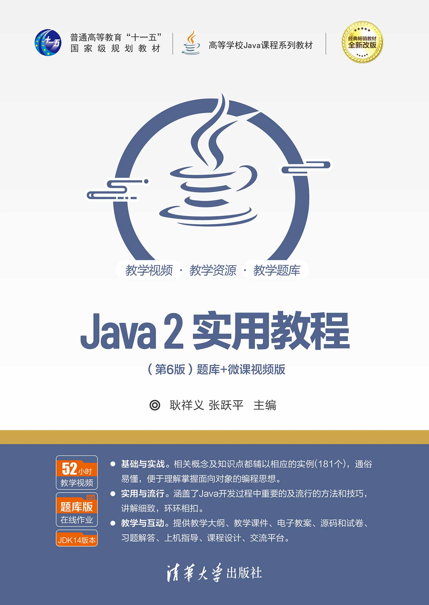

# Java 课程作业

本仓库包含Java编程学习过程中的课程作业项目，涵盖以下课程内容：

- "**Java 2实用教程**" 第6版（作者：_耿祥义、张跃平_ / _清华大学出版社_）

如有任何问题或建议，欢迎通过邮箱 [**carm@carm.cc**](mailto:carm@carm.cc)
或 [issues](https://github.com/CarmJos/mcu-courseworks/issues/new) 联系我。

## 项目结构

- `src/` 源代码目录。
- `docs/` 文档目录。

## 环境要求

- Java开发环境（JDK）
- 兼容的IDE（如IntelliJ IDEA、Eclipse等）
- Maven构建工具

## 开源许可证

本项目源代码采用 [GNU通用公共许可证 v3.0](https://opensource.org/licenses/GPL-3.0) 开源协议。

## 支持

感谢 JetBrains 为我们提供免费的开发工具许可证，以便我致力于此项目及其他开源项目的开发工作。  

