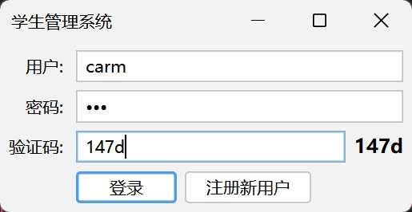
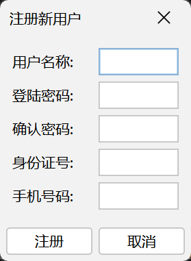
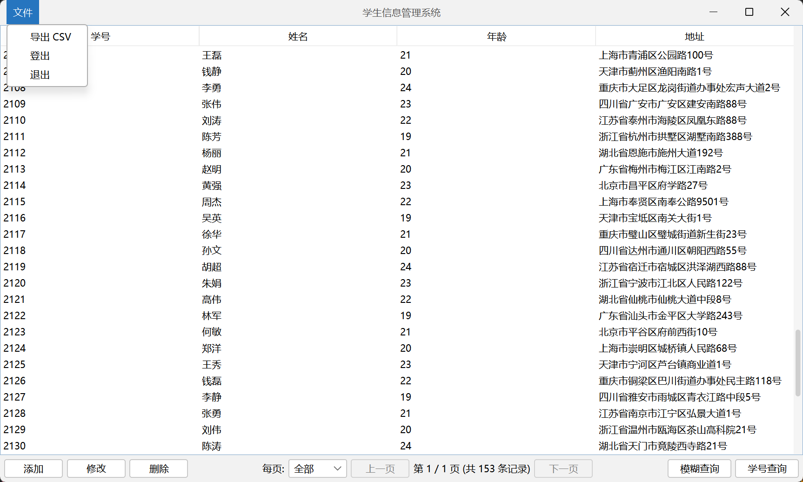

# 实训项目：学生管理系统

## 1. 项目简介

本项目是一个基于 Java 实现的命令行学生管理系统。它提供了一个简洁的交互界面，支持用户注册、登录，并对学生信息进行增、删、改、查等基本操作。

项目旨在演示 Java 在控制台应用程序开发中的应用，整合了数据库操作、密码加密、数据校验等常用功能，结构清晰，适合初学者学习和实践。





## 2. 技术栈

- **核心语言**: `Java 21`
- **构建工具**: `Maven`
- **数据库**: `H2 Database` (一个轻量级的嵌入式Java数据库)
- **数据库访问**: `EasySQL` (一个简化JDBC操作的自定义库)
- **日志**: `SLF4J`

## 3. 功能列表

- **用户模块**
    - [x] 用户注册 (用户名、密码、身份证、手机号)
    - [x] 用户登录
    - [x] 密码加密存储 (使用 `BCrypt` 算法)
    - [x] 输入数据格式校验 (身份证、手机号)
- **学生信息管理模块**
    - [x] 添加学生信息 (学号、姓名、年龄、地址)
    - [x] 删除学生信息
    - [x] 修改学生信息
    - [x] 查询单个学生信息
    - [x] 列出所有学生信息
- **数据持久化**
    - [x] 所有用户和学生数据均存储在 H2 数据库中，程序重启后数据不丢失。

## 4. 项目结构

项目代码遵循了良好的分层结构，将不同的功能模块划分到独立的包中，便于维护和理解。

```
practicum/
└── src/main/java/cc/carm/study/practicum/student/
    ├── Main.java               # 程序主入口，负责命令行交互和流程控制
    ├── data/
    │   ├── Student.java        # 学生数据模型 (Record)
    │   └── User.java           # 用户数据模型 (Record)
    ├── database/
    │   └── DataTables.java     # 定义数据库表结构和初始化逻辑
    ├── manager/
    │   ├── DataManager.java    # 数据库连接和会话管理器
    │   ├── StudentManager.java # 学生信息的业务逻辑处理
    │   └── UserManager.java    # 用户管理的业务逻辑处理
    └── utils/
        ├── BCrypt.java         # BCrypt 密码哈希工具类
        └── Validators.java     # 身份证、手机号等格式的校验工具类
```

- **`Main.java`**: 整个应用的“大脑”，负责接收用户输入，根据用户是否登录来分发到不同的处理方法。
- **`data`**: 定义了核心的数据对象 `User` 和 `Student`。使用 Java 14+ 的 `Record` 特性，代码简洁明了。
- **`manager`**: 业务逻辑层。
    - `DataManager` 封装了与数据库的连接和关闭操作。
    - `UserManager` 和 `StudentManager` 分别处理用户和学生相关的操作，如注册、查询等，实现了业务逻辑与数据访问的分离。
- **`utils`**: 提供通用的工具类。`BCrypt` 用于密码安全，`Validators` 用于保证输入数据的有效性。

## 5. 如何运行

1. 确保您的环境中已安装 `Java 21` 和 `Maven`。
2. 在项目根目录 (包含 `pom.xml` 的目录) 下，打开终端。
3. 执行 `mvn clean package` 来编译和打包项目。
4. 运行 `java -jar target/practicum-1.0-SNAPSHOT.jar` (具体jar包名称以 `target` 目录下生成的为准)。
5. 程序启动后，会生成一个 `.tmp` 文件夹，其中包含了 `data.mv.db` 数据库文件。